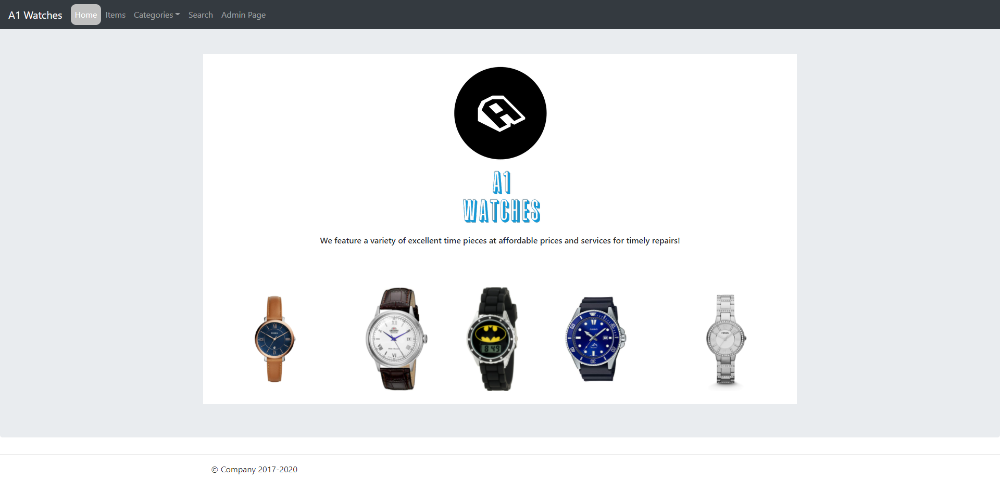
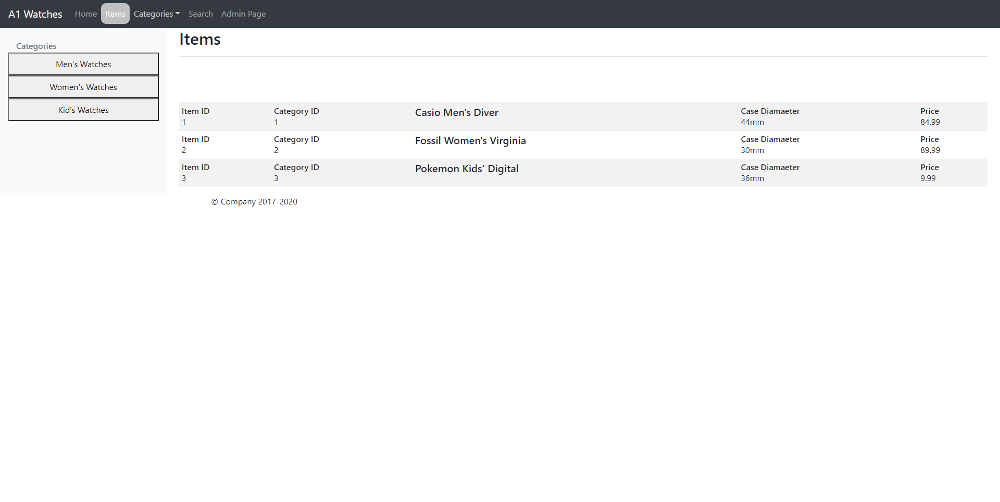
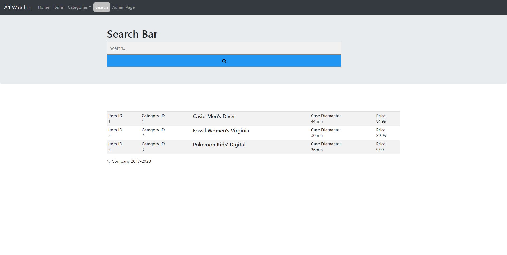
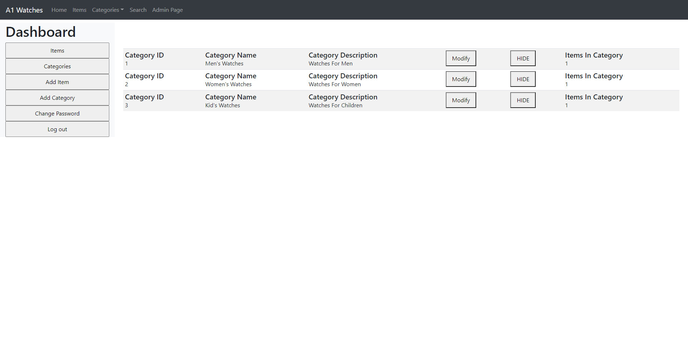

# PHP_MySQL_Shop_Website
----------------------------------------

###### Description

Project makes use of PHP & MySQL technologies to create a website which lists items a client wants to sell online ( Watches in our case ). 
Necessary operations of the project are CRUD operations of items and categories, validation of input fields, as well as administrator 
features such as hiding / showing items, and site maintenance.

----------------------------------------

###### Installation & Run Guide

* Requires XAMPP

* Clone repository

* Copy the Assignment2 folder into the xampp/htdocs folder

* in the XAMPP control panel, start the Apache and MySQL servicees and in a browser paste this link

	* localhost/assignment2/public/

----------------------------------------

----------------------------------------

###### Operations

* CRUD operatiosn on items and categories

* search for an item by title and description

* change a category or item status to HIDE or SHOW

* validation of form input fields

* Administrator dashboard and admin password change